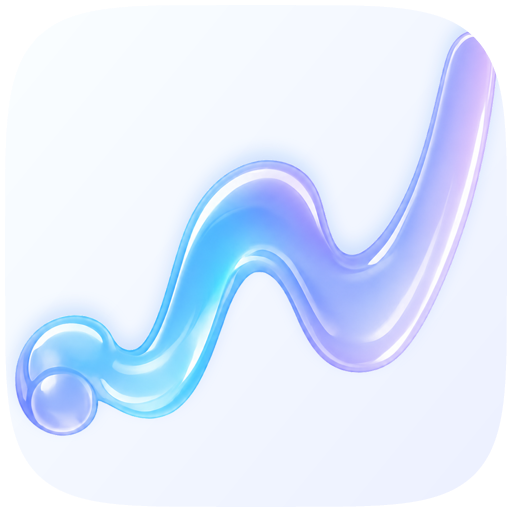
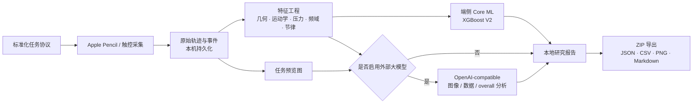

<p align="center">
  
</p>

<h1 align="center">neurotrace</h1>

<p align="center">
  面向 iPad 与 Apple Pencil 的神经行为手写研究平台<br>
  记录书写与触控行为，提取候选数字生物标志物，并探索帕金森相关早期运动线索
</p>

<p align="center">
  <a href="README_EN.md">English</a> · <strong>简体中文</strong>
</p>

<p align="center">
  <a href="https://github.com/chiang881/neurotrace-ipad/actions/workflows/mac-preview-release.yml"></a>
  <a href="https://github.com/chiang881/neurotrace-ipad/releases"></a>
  
  
  
  
  
  
  <a href="LICENSE"></a>
</p>

> [!CAUTION]
> **本项目是研究原型，不是医疗器械。** 输出仅表示模型识别到的“研究关注程度”，不等同于患病概率、早期帕金森诊断、筛查结论或治疗建议。当前模型仍需要真实 iPad 队列、独立外部验证、校准与亚组评估，不能用于临床决策。

## 项目简介

neurotrace 把标准化手写/触控任务、Apple Pencil 高密度采样、端侧机器学习和可审计的数据导出整合在一个 iPad App 中。研究人员可以建立受试者研究编号（建议去标识化），执行快速或完整任务协议，保存原始轨迹与特征，在设备端运行 Core ML 模型，并按需启用兼容 OpenAI API 的多模态模型进行补充分析。

项目关注的是传统纸笔检查难以保留的动态信息：书写速度与加速度、停顿、曲率、压力变化、笔倾角、频域能量、敲击节律及左右手差异等。这些信号可用于探索震颤、运动迟缓、节律不稳和小写症等帕金森相关运动线索。

### 当前能力

- Apple Pencil 轨迹、压力、倾角、方位角、接触阶段与合并触点采集
- 快速 6 项 / 完整 11 项研究任务协议，支持中断恢复与重做
- 几何、运动学、压力、频域、模板误差和敲击节律特征计算
- 两个端侧 Core ML XGBoost 研究模型，无网络时也能运行
- 可选的图像、结构化数据与 overall 多模态综合分析
- SwiftData 元数据持久化，原始点、预览图和恢复文件默认保存在本机
- ZIP 研究包导出：JSON、CSV、PNG 和 Markdown 报告
- iPad 原生 UIKit 界面及 Apple Silicon Mac Catalyst 预览构建

## 研究任务

| 类别 | 任务 | 主要观察信号 |
|---|---|---|
| 螺旋 | 静态螺旋描摹、动态螺旋绘制 | 轨迹偏差、速度、曲率、震颤频段、压力稳定性 |
| 静止保持 | 左手 / 右手各 10 秒 | 位移、微动、压力及姿态稳定性 |
| 触屏敲击 | 左手 / 右手各 20 秒 | 间隔、准确率、交替错误、速度衰减 |
| 书写 | 英文短句抄写 | 字形尺度、拥挤程度、基线与笔画变化 |
| 图形描摹 | 波浪线、圆形 | 模板误差、节律、平滑度与空间控制 |
| 数字画钟 | 指令绘制、模板复制 | 构图、执行与视觉运动整合线索 |

快速模式约 4–6 分钟，完整模式约 8–12 分钟。**两个本地 V2 模型都要求静态螺旋与动态螺旋成对输入；快速模式只有动态螺旋，因此会跳过这两个本地模型。**

## 技术路线



### 1. 采集层

`PencilCanvasView` 和 `TappingPadView` 记录坐标、归一化坐标、时间戳、笔画编号、压力、最大压力、倾角、方位角、roll angle、接触半径、输入设备与触点阶段。系统同时保留 coalesced touches 和 Apple Pencil 估计属性更新，以降低采样稀疏和延迟造成的信息损失。

### 2. 特征层

通用 `FeatureEngine` 以名义 120 Hz 计算时长、路径长度、速度/加速度/jerk、曲率、停顿比例、压力统计、模板误差、频域特征和敲击节律等指标。模型专用特征器则将静态、动态螺旋转换为固定顺序的 28 维和 72 维向量；特征名、范围与输入契约均保存在仓库中，便于复现和审计。

### 3. 本地模型层

| 模型 | 输入 | 模型与阈值 | 仓库记录的开发期结果 | 关键限制 |
|---|---|---|---|---|
| `ParkinsonSpiralXGBV2` | 静态 + 动态螺旋，28 特征 | XGBoost 80 棵树，阈值 0.45 | 40 人 LOSO：ROC AUC 0.875，平衡准确率 0.807 | 15 名健康对照 / 25 名 PWP；阈值在同一小队列开发，尚无外部验证 |
| `ParkinsonXGBoostV2AllCommon` | 静态 + 动态螺旋，72 特征 | XGBoost 180 棵树，阈值 0.50 | 77 人内部结果：ROC AUC 0.949，平衡准确率 0.834 | 队列不平衡且存在采集批次混杂；训练版并非 iPad-compatible |

压力模型训练输入中的 `Z` 与 Apple Pencil 不同。当前 App 使用 `normalizedForce × 1023 × sin(altitudeAngle)` 作为垂直压力 proxy；它**不是原始数字化仪 Z 通道**，跨设备解释必须谨慎。详细说明见[螺旋模型卡](neurotrace-models/spiral/docs/MODEL_CARD_V2.md)和[压力模型输入规范](neurotrace-models/pressure/INPUT_SPEC.md)。

上述指标是开发期内部估计，不代表真实世界、早期或未确诊人群中的筛查性能。训练数据按项目说明来自公开研究数据，但当前仓库尚未给出可审计的数据集名称、DOI/URL 与许可证；正式发布研究结果前应补齐数据来源和使用授权。

### 4. 可选大模型层

App 可连接 OpenAI-compatible `chat/completions` 服务，对任务预览图、敲击结构化数据和所有任务结果进行补充分析。该能力默认关闭，本地特征计算和 Core ML 推理不依赖它。API Key 使用系统 Keychain 保存；端点与模型名可在 App 设置中修改。

启用后，任务图像和/或特征会发送到配置的第三方端点。研究部署前必须完成受试者知情同意、数据处理协议、跨境/留存评估与供应商安全审查。

### 5. 数据与导出

默认没有研究服务器上传功能。受试者、会话和任务元数据由 SwiftData 保存，原始采样点、点击事件、预览图和恢复数据位于 App 的 Application Support 目录。导出的 ZIP 包可能包含：

- `manifest.json`、`subject.json`、`session.json` 与 `test_summary.json`
- `raw_points.json`、`tap_events.json` 与 `features.csv`
- `preview_images/*.png`
- `analysis_report.json` 与 `analysis_report.md`（完成分析后）

导出包包含受试者编号、人口统计字段和高密度行为数据，应按敏感研究数据管理；共享前请去标识化并使用加密传输/存储。

## 技术栈与架构

| 层 | 实现 |
|---|---|
| UI | UIKit、UICollectionView Diffable Data Source、Coordinator、Mac Catalyst |
| 采集 | UIKit Touch APIs、Apple Pencil、Core Graphics |
| 状态与持久化 | SwiftData、JSON/PNG 文件、Application Support |
| 数值与特征 | Swift、Accelerate、自定义时序/频域特征器 |
| 端侧推理 | Core ML、XGBoost 转换模型 |
| 可选云分析 | Foundation Networking、OpenAI-compatible Chat Completions |
| 安全 | iOS Keychain、文件保护、默认本地存储 |
| 导出 | Codable、ZIPFoundation 0.9.20、CSV/JSON/PNG/Markdown |
| 模块化 | 本地 Swift Package `NeuroTraceKit`（`neurotrace-kit/`）：Domain / Application / Infrastructure / UIKit |
| 测试 | XCTest、单元测试、UI 测试、模型契约测试 |

核心依赖方向：`NeuroTraceDomain → NeuroTraceApplication → NeuroTraceInfrastructure / NeuroTraceUIKit`。Domain 与 Application 不依赖 UIKit；UIKit 模块也不直接依赖 SwiftData、Core ML 或网络层，便于替换基础设施和独立测试。

## 开始使用

### 环境要求

- macOS 与 Xcode 26.5 或更高版本
- iPadOS 26.5 或更高版本
- 推荐使用支持 Apple Pencil 的 iPad 真机进行采集
- Apple Developer 签名配置（部署到真机时）

Mac Catalyst 版本适合界面预览与流程演示，不能替代真实 Apple Pencil 设备上的采集和验证。

### 构建

```bash
git clone https://github.com/chiang881/neurotrace-ipad.git
cd neurotrace-ipad
open neurotrace.xcodeproj
```

在 Xcode 中选择 `neurotrace` scheme、设置自己的 Development Team，并运行到 iPad。Swift Package 依赖会按 `Package.resolved` 自动解析，所需的两个 V2 `.mlmodel` 已随 App target 提供。

也可以在 Apple Silicon Mac 上从命令行构建模拟器版本：

```bash
xcodebuild build \
  -project neurotrace.xcodeproj \
  -scheme neurotrace \
  -destination 'generic/platform=iOS Simulator' \
  ARCHS=arm64 \
  ONLY_ACTIVE_ARCH=YES \
  CODE_SIGNING_ALLOWED=NO
```

Apple Silicon Mac 预览包可在 [Releases](https://github.com/chiang881/neurotrace-ipad/releases) 下载。

### 测试

```bash
# NeuroTraceKit 边界与用例测试
swift test --package-path neurotrace-kit

# App 单元/UI 测试：将占位符替换为本机可用的 iPad 模拟器
xcodebuild test \
  -project neurotrace.xcodeproj \
  -scheme neurotrace \
  -destination 'platform=iOS Simulator,name=<iPad Simulator>' \
  CODE_SIGNING_ALLOWED=NO
```

## 仓库结构

```text
neurotrace-ipad/
├── neurotrace/                    # iPad / Mac Catalyst App
│   ├── Application/               # 应用边界协议
│   ├── Domain/                    # 受试者、会话、采集与分析模型
│   ├── Infrastructure/            # SwiftData、依赖组装与安全存储
│   ├── Input/                     # Apple Pencil / 触控采集视图
│   ├── Models/                    # Core ML 模型与本地特征器
│   ├── Services/                  # 特征、分析、导出和网络服务
│   └── UIKit/                     # 页面与 Coordinator
├── neurotrace-kit/                # 可替换边界的本地 Swift Package
├── neurotrace-models/             # 螺旋与压力模型接口、契约和模型卡
├── neurotrace-tools/              # 可复现的品牌资产工具
├── neurotraceTests/               # 单元与模型契约测试
└── neurotraceUITests/             # UI 与恢复流程测试
```

## 研究与产品路线

- [ ] 补充公开训练数据的名称、引用、许可、纳排标准和预处理流程
- [ ] 冻结采集协议、特征版本、模型与阈值，建立完整 model/data lineage
- [ ] 采集年龄/性别匹配的真实 iPad 队列，并进行独立站点前瞻性验证
- [ ] 报告置信区间、校准、设备/人口亚组表现和失败率
- [ ] 训练不依赖代理 `Z` 的 iPad-compatible 压力模型
- [ ] 为每次提交增加自动构建、测试和模型契约 CI
- [ ] 完善隐私政策、伦理审批模板、数据保留与删除流程

## 参与贡献

欢迎提交 Issue 或 Pull Request。修改采集协议、特征顺序、模型文件或阈值时，请同步更新输入契约、模型卡、指标文件和测试；这类变化会影响研究数据的可比性，不应只修改 App 展示层。

## 许可证

本项目采用 [MIT License](LICENSE)。第三方数据与依赖仍受各自许可证约束；研究与医疗使用还需自行完成伦理、隐私、监管和有效性评估。

## 致谢

感谢公开神经行为数据与数字手写研究社区，以及 Apple Pencil、Core ML、XGBoost、Swift 和 ZIPFoundation 生态。本项目后续会在数据来源可审计后补充正式数据集引用。
