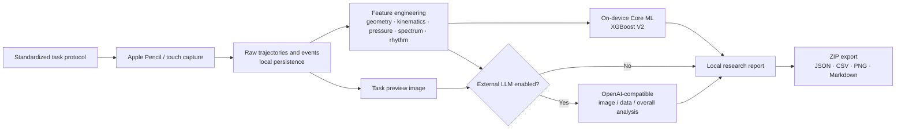

<p align="center">
  
</p>

<h1 align="center">neurotrace</h1>

<p align="center">
  A neurobehavioral handwriting research platform for iPad and Apple Pencil<br>
  Capture writing and touch behavior, extract candidate digital biomarkers, and explore early Parkinson-related motor signals
</p>

<p align="center">
  <strong>English</strong> · <a href="README.md">简体中文</a>
</p>

<p align="center">
  <a href="https://github.com/chiang881/neurotrace-ipad/actions/workflows/mac-preview-release.yml"></a>
  <a href="https://github.com/chiang881/neurotrace-ipad/releases"></a>
  
  
  
  
  
  
  <a href="LICENSE"></a>
</p>

> [!CAUTION]
> **This project is a research prototype, not a medical device.** Its outputs express model-derived “research attention” only. They are not disease probabilities, an early Parkinson's diagnosis, a screening result, or treatment advice. The current models still require a real iPad cohort, independent external validation, calibration, and subgroup evaluation before any clinical use.

## Overview

neurotrace brings standardized handwriting/touch tasks, high-density Apple Pencil sampling, on-device machine learning, and auditable research exports into one iPad app. Researchers can create pseudonymous participant records, run a quick or full protocol, preserve raw trajectories and features, execute bundled Core ML models, and optionally add multimodal analysis through an OpenAI-compatible API.

The project focuses on dynamic information that conventional paper tests do not retain: writing velocity and acceleration, pauses, curvature, pressure variation, pencil attitude, spectral energy, tapping rhythm, and inter-hand differences. These signals can support research into Parkinson-related motor features such as tremor, bradykinesia, rhythm instability, and micrographia.

### What it currently does

- Captures Apple Pencil position, pressure, attitude, azimuth, touch phase, and coalesced touches
- Provides quick 6-task and full 11-task protocols with recovery and redo support
- Computes geometric, kinematic, pressure, spectral, template-error, and tapping-rhythm features
- Runs two on-device Core ML XGBoost research models without a network connection
- Optionally performs image, structured-data, and overall multimodal analysis
- Persists metadata with SwiftData and keeps raw points, previews, and recovery files locally by default
- Exports ZIP research bundles containing JSON, CSV, PNG, and Markdown reports
- Provides a native iPad UIKit experience and an Apple Silicon Mac Catalyst preview

## Research tasks

| Category | Tasks | Signals of interest |
|---|---|---|
| Spiral | Static tracing and dynamic freehand spiral | Trace error, velocity, curvature, tremor bands, pressure stability |
| Hold still | 10 seconds per hand | Displacement, micro-movement, pressure, and attitude stability |
| Screen tapping | 20 seconds per hand | Inter-tap interval, accuracy, alternation errors, and slowing |
| Handwriting | English sentence copying | Scale, crowding, baseline drift, and stroke change |
| Shape tracing | Wave and circle | Template error, rhythm, smoothness, and spatial control |
| Clock drawing | Command and copy conditions | Construction, execution, and visuomotor signals |

Quick mode takes about 4–6 minutes; full mode takes about 8–12 minutes. **Both local V2 models require paired static and dynamic spiral inputs. Quick mode contains only the dynamic spiral, so it skips both local models.**

## Technical pipeline



### 1. Capture

`PencilCanvasView` and `TappingPadView` record raw and normalized coordinates, timestamps, stroke IDs, force and maximum force, altitude, azimuth, roll angle, contact radius, input device, and touch phase. Coalesced touches and Apple Pencil estimated-property updates are retained to reduce information loss from sparse or delayed samples.

### 2. Feature engineering

The general `FeatureEngine` uses a nominal 120 Hz rate to compute duration, path length, velocity/acceleration/jerk, curvature, stationary ratio, pressure statistics, template error, spectral features, and tapping rhythm. Model-specific extractors transform paired static and dynamic spirals into fixed-order 28- and 72-dimensional vectors. Feature names, ranges, and input contracts are versioned in the repository for reproducibility and auditability.

### 3. Local models

| Model | Input | Model and threshold | Repository development result | Main limitation |
|---|---|---|---|---|
| `ParkinsonSpiralXGBV2` | Paired static + dynamic spirals, 28 features | 80-tree XGBoost, threshold 0.45 | 40-subject LOSO: ROC AUC 0.875, balanced accuracy 0.807 | 15 controls / 25 PWP; threshold developed on the same small cohort; no external validation |
| `ParkinsonXGBoostV2AllCommon` | Paired static + dynamic spirals, 72 features | 180-tree XGBoost, threshold 0.50 | 77-subject internal result: ROC AUC 0.949, balanced accuracy 0.834 | Imbalanced cohort and acquisition-batch confounding; training model is not iPad-compatible |

The pressure model's training `Z` channel is not available from Apple Pencil. The app currently substitutes `normalizedForce × 1023 × sin(altitudeAngle)` as a vertical-pressure proxy. It is **not the original digitizer Z channel**, so cross-device interpretation requires particular care. See the [spiral model card](neurotrace-models/spiral/docs/MODEL_CARD_V2.md) and [pressure-model input specification](neurotrace-models/pressure/INPUT_SPEC.md) for details.

These figures are internal development estimates; they do not establish performance in real-world, early-stage, or undiagnosed populations. The project description states that training uses public research data, but the repository does not yet provide auditable dataset names, DOI/URLs, or licenses. Add provenance and usage rights before publishing study results.

### 4. Optional multimodal model

The app can connect to an OpenAI-compatible `chat/completions` service for task-image analysis, structured tapping analysis, and an overall review. This feature is off by default; local feature computation and Core ML inference do not depend on it. The API key is stored in the system Keychain, and the endpoint and model name can be changed in Settings.

When enabled, task images and/or features are sent to the configured third-party endpoint. A research deployment must cover informed consent, data-processing terms, transfer and retention rules, and vendor security review.

### 5. Storage and export

No research-server upload is configured by default. Subject, session, and task metadata are persisted with SwiftData, while raw samples, tap events, preview images, and recovery files live in Application Support. An exported ZIP may contain:

- `manifest.json`, `subject.json`, `session.json`, and `test_summary.json`
- `raw_points.json`, `tap_events.json`, and `features.csv`
- `preview_images/*.png`
- `analysis_report.json` and `analysis_report.md` after analysis

Exports contain participant codes, demographic fields, and high-density behavioral data. Treat them as sensitive research data; de-identify before sharing and use encrypted transport and storage.

## Stack and architecture

| Layer | Implementation |
|---|---|
| UI | UIKit, UICollectionView Diffable Data Source, Coordinator, Mac Catalyst |
| Capture | UIKit Touch APIs, Apple Pencil, Core Graphics |
| State and persistence | SwiftData, JSON/PNG files, Application Support |
| Numerics and features | Swift, Accelerate, custom time-series/spectral extractors |
| On-device inference | Core ML, converted XGBoost models |
| Optional cloud analysis | Foundation Networking, OpenAI-compatible Chat Completions |
| Security | iOS Keychain, file protection, local-first defaults |
| Export | Codable, ZIPFoundation 0.9.20, CSV/JSON/PNG/Markdown |
| Modularity | Local `NeuroTraceKit` package (`neurotrace-kit/`): Domain / Application / Infrastructure / UIKit |
| Tests | XCTest, unit tests, UI tests, and model contract tests |

The core dependency direction is `NeuroTraceDomain → NeuroTraceApplication → NeuroTraceInfrastructure / NeuroTraceUIKit`. Domain and Application do not import UIKit; the UIKit package product does not directly import SwiftData, Core ML, or networking. This keeps infrastructure replaceable and boundaries independently testable.

## Getting started

### Requirements

- macOS with Xcode 26.5 or later
- iPadOS 26.5 or later
- A real Apple Pencil-compatible iPad is recommended for capture
- Apple Developer signing configuration for device deployment

The Mac Catalyst build is suitable for UI previews and workflow demonstrations; it is not a substitute for capture and validation on real Apple Pencil hardware.

### Build

```bash
git clone https://github.com/chiang881/neurotrace-ipad.git
cd neurotrace-ipad
open neurotrace.xcodeproj
```

In Xcode, select the `neurotrace` scheme, configure your Development Team, and run on iPad. Swift Package dependencies resolve from `Package.resolved`, and the two required V2 `.mlmodel` files are already included in the app target.

To build for the simulator from an Apple Silicon Mac:

```bash
xcodebuild build \
  -project neurotrace.xcodeproj \
  -scheme neurotrace \
  -destination 'generic/platform=iOS Simulator' \
  ARCHS=arm64 \
  ONLY_ACTIVE_ARCH=YES \
  CODE_SIGNING_ALLOWED=NO
```

An Apple Silicon Mac preview is available from [Releases](https://github.com/chiang881/neurotrace-ipad/releases).

### Tests

```bash
# NeuroTraceKit boundary and use-case tests
swift test --package-path neurotrace-kit

# App unit/UI tests: replace the placeholder with a locally available iPad simulator
xcodebuild test \
  -project neurotrace.xcodeproj \
  -scheme neurotrace \
  -destination 'platform=iOS Simulator,name=<iPad Simulator>' \
  CODE_SIGNING_ALLOWED=NO
```

## Repository layout

```text
neurotrace-ipad/
├── neurotrace/                    # iPad / Mac Catalyst app
│   ├── Application/               # Application boundary protocols
│   ├── Domain/                    # Subject, session, capture, and analysis models
│   ├── Infrastructure/            # SwiftData, dependency assembly, secure storage
│   ├── Input/                     # Apple Pencil / touch capture views
│   ├── Models/                    # Core ML models and local feature extractors
│   ├── Services/                  # Features, analysis, export, and networking
│   └── UIKit/                     # Screens and coordinator
├── neurotrace-kit/                # Local Swift package for replaceable boundaries
├── neurotrace-models/             # Spiral/pressure interfaces, contracts, and model cards
├── neurotrace-tools/              # Reproducible brand-asset tooling
├── neurotraceTests/               # Unit and model-contract tests
└── neurotraceUITests/             # UI and recovery-flow tests
```

## Research and product roadmap

- [ ] Document public training dataset names, citations, licenses, inclusion criteria, and preprocessing
- [ ] Freeze the capture protocol, feature versions, models, and thresholds; establish model/data lineage
- [ ] Collect an age- and sex-matched real-iPad cohort and perform prospective external-site validation
- [ ] Report confidence intervals, calibration, device/demographic subgroup performance, and failure rates
- [ ] Train an iPad-compatible pressure model that does not depend on a proxy `Z` channel
- [ ] Add per-commit build, test, and model-contract CI
- [ ] Complete privacy policy, ethics templates, and data retention/deletion procedures

## Contributing

Issues and pull requests are welcome. If you change a capture protocol, feature order, model artifact, or threshold, update the input contracts, model card, metrics, and tests at the same time. These changes affect research comparability and should never be treated as presentation-only edits.

## License

This project is released under the [MIT License](LICENSE). Third-party data and dependencies remain subject to their respective licenses. Research or medical use still requires independent ethics, privacy, regulatory, and validity review.

## Acknowledgements

Thanks to the public neurobehavioral-data and digital-handwriting research communities, and to the Apple Pencil, Core ML, XGBoost, Swift, and ZIPFoundation ecosystems. Formal dataset citations will be added once provenance is auditable.
